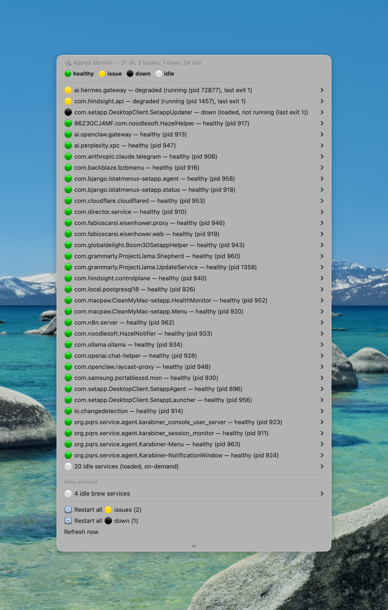

# Agents Monitor

A lightweight macOS menu bar panel for monitoring and controlling user-domain LaunchAgents and Homebrew services. Powered by [SwiftBar](https://swiftbar.app).

Surfaces what's healthy, what's flapping, what's silently failing — and lets you restart any of it with one click. Designed to catch the kind of "loaded but broken" silent failures that `launchctl list` hides.



The menu bar item summarizes the fleet at a glance:


Version: `0.1.0`.

## What it shows

For every user-domain LaunchAgent and Homebrew service, a colored dot:

- 🟢 **healthy** — process alive, last exit clean
- 🟡 **issue** — running but degraded (non-zero last exit) **or** flapping (PID changed within the last `FLAP_WINDOW` seconds, default 120)
- ⚫ **down** — loaded but the process exited with a non-zero status; or brew service in `error` state
- ⚪ **idle** — loaded on-demand, currently not running with clean last exit (normal for most vendor LoginHelpers, OneDriveLauncher, GoogleUpdater.wake, ssh-agent, etc.)

The menu-bar header summarizes the fleet at a glance: `🟢 N` if all good, `🟡 ok/total` if any issues, `⚫ ok/total` if anything down.

Per-service submenu: **Restart** / **Hide from monitor** / **Show details (launchctl print)**. Plus global "Restart all 🟡 issues" and "Restart all ⚫ down" actions at the bottom of the panel.

A macOS notification fires when a service degrades — transitions INTO 🟡 or ⚫ from a previously better state. Specifically:

| Previous → Current | Notification? |
|---|---|
| `healthy` → `issue` | ✅ |
| `idle` → `issue` | ✅ |
| `healthy` → `down` | ✅ |
| `idle` → `down` | ✅ |
| `issue` → `down` | ✅ |
| `down` → anything | ❌ (not a degradation) |
| `issue` → `healthy` (recovery) | ❌ |
| anything → `idle` | ❌ |
| first sight (no previous state) | ❌ |

Single batched notification per refresh; no spam.

## Requirements

- macOS 12 or newer (Apple Silicon or Intel)
- [Homebrew](https://brew.sh) — must be installed beforehand (the installer doesn't bootstrap Homebrew itself)
- bash 4+ — default macOS `/bin/bash` is 3.2 (too old). The installer offers to install via `brew install bash` if missing.
- [SwiftBar](https://swiftbar.app) — the installer offers to install via `brew install --cask swiftbar` if missing.

`osascript` (built into macOS) is used for native notifications. SwiftBar will request Accessibility / Notifications permissions on first launch — grant them or the panel will look broken.

## Install

> **Before running `install.sh`, read it.** It's ~150 lines of bash. Specifically it: validates dependencies, copies binaries to `~/.local/bin/`, copies the plugin to `~/.local/share/agents-monitor/swiftbar/`, creates `~/.config/agents-monitor/`, and either writes `defaults com.ameba.SwiftBar PluginDirectory` (if unset) or symlinks the plugin into your existing PluginDirectory (if you already use SwiftBar). It does not require sudo and never elevates. See [Security model](#security-model) for the full trust boundary.

We recommend pinning to a tagged release rather than `main`:

```bash
git clone --branch v0.1.0 https://github.com/fabioscarsi/agents-monitor.git
cd agents-monitor
./install.sh
```

The installer runs a comprehensive preflight phase BEFORE touching disk:
1. Verifies Homebrew is present (errors out if not — does not bootstrap Homebrew itself)
2. Verifies bash 4+ at `/opt/homebrew/bin/bash` or `/usr/local/bin/bash` (offers `brew install bash` if missing)
3. Verifies SwiftBar.app is in `/Applications` (offers `brew install --cask swiftbar` if missing)
4. Verifies the parent directory of `~/.local/bin/` is owned by you and not group/world-writable (refuses to install otherwise — see [Security model](#security-model))
5. Verifies the SwiftBar PluginDirectory (if already set) exists and is writable

If preflight passes, then state-changing operations begin:
- Copies scripts to `~/.local/bin/` and `~/.local/share/agents-monitor/`
- Initializes `~/.config/agents-monitor/blocklist.conf` (only if missing — your edits are preserved on reinstall)
- Configures the plugin: writes `PluginDirectory` if unset, OR symlinks the plugin into your existing PluginDirectory (single source of truth — the live plugin is always the managed file under `~/.local/share/agents-monitor/swiftbar/`, no orphan copies)
- Launches SwiftBar

The menu-bar item should appear within 30 seconds. If not, see [Troubleshooting](#troubleshooting).

## File layout (after install)

```
~/.local/bin/launchctl-user                              # idempotent restart helper
~/.local/bin/agents-monitor-uninstall                    # removes everything (interactive)
~/.config/agents-monitor/blocklist.conf                  # YOUR personal exclusions
~/.config/agents-monitor/local.conf.example              # optional knobs template
~/.local/share/agents-monitor/swiftbar/agents-monitor.30s.sh  # the SwiftBar plugin (if the managed dir is the live one)
~/.local/share/agents-monitor/.plugin-installed-at       # pointer to live plugin location (only if non-default)
~/.cache/agents-monitor/pids.tsv                         # ephemeral state (PID stability + class history)
```

If SwiftBar already had a different PluginDirectory configured before install, the plugin lives in that directory instead, and `.plugin-installed-at` records the path so the uninstaller can find it.

## Customization

### Hide noisy services

Click **Hide from monitor** on any row. The label is appended to `~/.config/agents-monitor/blocklist.conf`. Edit that file to un-hide.

The blocklist is auto-discovered via `launchctl list` and `brew services list`. You only need to maintain exclusions, not inclusions — new services appear automatically as soon as they're loaded.

### Override defaults

Copy the example file:

```bash
cp ~/.config/agents-monitor/local.conf.example ~/.config/agents-monitor/local.conf
```

Then uncomment any line in `local.conf` to override. Currently supported knob:

- `FLAP_WINDOW=120` — seconds. A service is flagged as 🟡 flapping if its PID changes within this window. Lower = more sensitive.

`local.conf` is parsed as data (`KEY=VALUE`), not sourced as bash. Only keys in the recognized list take effect; anything else is silently ignored. This is deliberate — see [Security model](#security-model).

Path overrides (`AGENTS_MONITOR_CONFIG_DIR`, `AGENTS_MONITOR_CACHE_DIR`, `AGENTS_MONITOR_HELPER`) must be set as environment variables BEFORE SwiftBar starts; they cannot be set in `local.conf` (chicken-and-egg with where to find `local.conf` itself).

### Auto-start at login

Add SwiftBar to your macOS login items via System Settings → General → Login Items, or via:

```bash
osascript -e 'tell application "System Events" to make login item at end with properties {path:"/Applications/SwiftBar.app", hidden:true}'
```

## How it works

The plugin runs every 30 seconds (interval encoded in the filename `agents-monitor.30s.sh`).

For each refresh it:
1. Enumerates user-domain LaunchAgents via `launchctl list` (filters out `com.apple.*`, `application.*`, `homebrew.mxcl.*`, your blocklist entries, and any label containing shell metacharacters)
2. Calls `launchctl print gui/$UID/<label>` for each — `print` shows current authoritative state, while `list` shows stale exit codes that mislead diagnostics
3. Cross-checks each PID with `kill -0 $pid` to confirm the process is actually alive
4. Compares each PID to the previous refresh — if it changed within `FLAP_WINDOW` seconds, flags as 🟡 flapping
5. Adds Homebrew services from `brew services list`
6. Diffs current classifications against the previous refresh — fires a single batched macOS notification for any service that degraded
7. Renders the panel sorted by severity (issues → down → healthy → collapsed idle group), with per-service submenus and global actions

State (PID + classification per service) is persisted to `~/.cache/agents-monitor/pids.tsv` between refreshes — that's how flap detection and degradation alerting work.

## Security model

The plugin runs in your user account with whatever permissions you have. It does not use `sudo`, never elevates, and operates only in the user-domain launchd scope (`gui/$UID`). Specifically:

- **No privilege escalation.** All `launchctl` calls target the user domain. The helper script refuses to operate on system services.
- **No sudo invocations anywhere.** Verifiable via `grep sudo` over the entire repo.
- **`local.conf` is parsed as data.** Only `KEY=VALUE` lines with keys in an explicit allowlist take effect. Arbitrary shell or unknown keys are silently ignored. This avoids `local.conf` becoming a persistent code-execution sink for any process that can write to your config directory.
- **Service labels are validated against `^[A-Za-z0-9._-]+$`** before being embedded in any shell command string. Labels containing single quotes, dollar signs, backticks, semicolons, or other shell metacharacters are skipped from the panel (they wouldn't be conformant launchd labels anyway).
- **Paths are quoted in dynamic shell command strings** so a `$HOME` containing spaces does not break menu actions.
- **The `Restart` button calls a small helper** (`~/.local/bin/launchctl-user`) which you can audit. If a hostile process replaces the helper, every Restart click runs the replacement — same risk as any user-installed binary on your `$PATH`.
- **Notifications use `osascript`**; the rendered notification text is escaped before being passed to AppleScript.

If you have stricter requirements (corp-managed Mac, MDM-enforced policies, security audit), inspect the four short scripts directly — the entire codebase is under 700 lines of bash.

## Troubleshooting

### The menu-bar item never appears

1. Confirm SwiftBar is running: `pgrep -x SwiftBar` should return a PID. If not: `open -a SwiftBar`.
2. Find where SwiftBar is actually looking for plugins:
   ```bash
   defaults read com.ameba.SwiftBar PluginDirectory
   cat ~/.local/share/agents-monitor/.plugin-installed-at 2>/dev/null
   ```
   The first command shows the directory SwiftBar reads from. If you previously had a custom PluginDirectory, the installer placed the plugin there as a symlink — the second command shows where.
3. Verify the plugin file (or symlink) actually exists at that path and is executable: `ls -la <path>` should show `-rwxr-xr-x` or `lrwxr-xr-x`.
4. If the file is a regular file but not executable: `chmod +x <path>`.
5. Look at SwiftBar's plugin error pane: right-click the SwiftBar icon → SwiftBar shows per-plugin errors directly when a plugin crashes.

### Notifications never fire on degradation

macOS requires explicit Notifications permission for the process that runs `osascript`. SwiftBar runs the plugin in its own context, so the permission prompt is for SwiftBar.app:

System Settings → Notifications → SwiftBar → Allow Notifications

If you ever clicked "Don't Allow", you have to re-enable manually here.

### "Operation not permitted" from `launchctl print`

Some labels under heavy sandbox restrictions reject `launchctl print` from a non-system context. Those services will show as ⚫ down with `not loaded` detail. There is no clean workaround short of granting SwiftBar Full Disk Access.

### A service shows "absent" or "not loaded" but I know it's running

Check with `launchctl print gui/$(id -u)/<label>` directly in a terminal. If it returns the same "absent", the service is in a different launchd domain (e.g. `system/`) — this plugin only monitors `gui/$UID`, by design.

### Panel shows "31/0" or other obviously broken counter

State file corruption, very rare. Fix: `rm ~/.cache/agents-monitor/pids.tsv` and wait one refresh cycle for it to regenerate.

### After install, the plugin file is in two places

This shouldn't happen with the current installer (it deliberately avoids the two-copies pattern). If you upgraded from an earlier version that did this, run the uninstaller first, then reinstall.

### `osascript` notification truncation

macOS truncates `display notification` text after roughly 256 characters. If many services degrade simultaneously, the body may be cut off. Check the panel directly for the full list.

## Why SwiftBar (not Raycast)

Raycast Script Commands support `silent | compact | inline | fullOutput` modes only — there is no `menu-bar` mode. Raycast menu-bar items require a full TypeScript Extension with `MenuBarExtra` (a separate, larger project). SwiftBar is purpose-built for exactly this pattern — same xbar plugin format, drop-in.

If you already use Raycast for everything else, SwiftBar runs alongside without conflict.

## Why bash 4+

The plugin uses associative arrays (`declare -A`) for blocklist lookup and previous-state diffing. Default macOS `/bin/bash` is still 3.2 (frozen since 2007 for license reasons). The plugin re-execs itself under `/opt/homebrew/bin/bash` (Apple Silicon) or `/usr/local/bin/bash` (Intel) if launched with the system bash; you'll get a clear error message if neither is available.

## Uninstall

```bash
~/.local/bin/agents-monitor-uninstall            # default: PRESERVES your config
~/.local/bin/agents-monitor-uninstall --purge    # also removes ~/.config/agents-monitor/ (your blocklist + local.conf)
```

Interactive prompt by default; pass `-y` to skip confirmation. The uninstaller:
- Quits SwiftBar so plugin file handles are released cleanly
- Reverts the SwiftBar `PluginDirectory` preference **only if** this installer set it (i.e., it points at the managed dir)
- Removes the symlink (or file) from a non-default SwiftBar PluginDirectory if the installer placed one there
- Validates the recorded plugin pointer file before consuming it (refuses to act on a malformed `.plugin-installed-at`)
- **Preserves `~/.config/agents-monitor/` by default** so your blocklist and tuning survive a "reinstall fresh" cycle. Use `--purge` to delete it.

Does NOT remove SwiftBar.app or its other plugins. To go further:

```bash
brew uninstall --cask swiftbar
defaults delete com.ameba.SwiftBar
```

## Known limitations

- **No semantic health probes.** The panel reports launchd's view of state. A service can be 🟢 healthy from launchd's perspective but actually broken at the application layer (e.g. an HTTP server that's running but returning 500s on `/health`). For that you'd need a separate per-service probe, which is out of scope for this project.
- **"Restart all" stops at first failure.** The global "Restart all 🟡 issues" / "Restart all ⚫ down" actions chain commands with `&&`, so the first failed restart halts the chain. Use the per-service Restart in the submenu for best-effort behavior.
- **No way to UN-collapse the idle group inline.** The `⚪ N idle services` line is a hover-submenu only.
- **`pids.tsv` grows monotonically.** Removed services keep their entries until you `rm ~/.cache/agents-monitor/pids.tsv`. Low impact in practice (a few KB per year for typical fleets).
- **Tested on Apple Silicon.** The bash shebang detection covers Intel paths too; should work on Intel Macs but isn't validated there. Reports/PRs welcome.
- **`launchctl print` output format is not formally stable across macOS versions.** Currently tested on macOS 14 and 15; older or newer versions may break the `awk -F'= '` parser.

## Acknowledgments

The `launchctl-user` helper is adapted from [this ChatGPT shared conversation on safe start-stop flows with Raycast](https://chatgpt.com/share/69ec6bdd-aeec-8333-806e-f18e9c24647f). The plist template in that conversation has portability bugs (notably `WorkingDirectory /Users/$USER` doesn't shell-expand in launchd plists, and `/tmp/` log paths are poor hygiene) — those are not used here. The helper script itself is structurally similar to that source with a small idempotency fix on exit codes.

## License

MIT — see [LICENSE](LICENSE).
